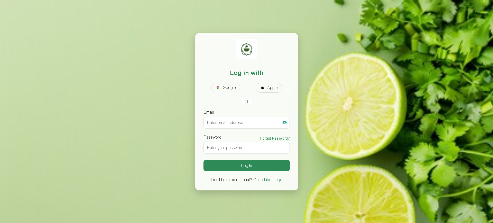
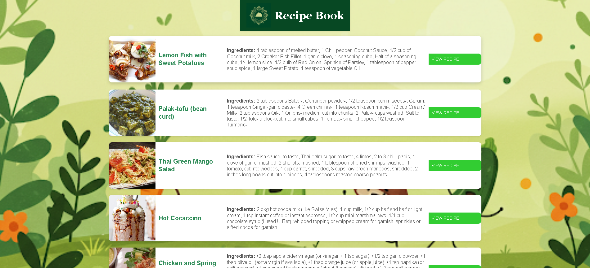
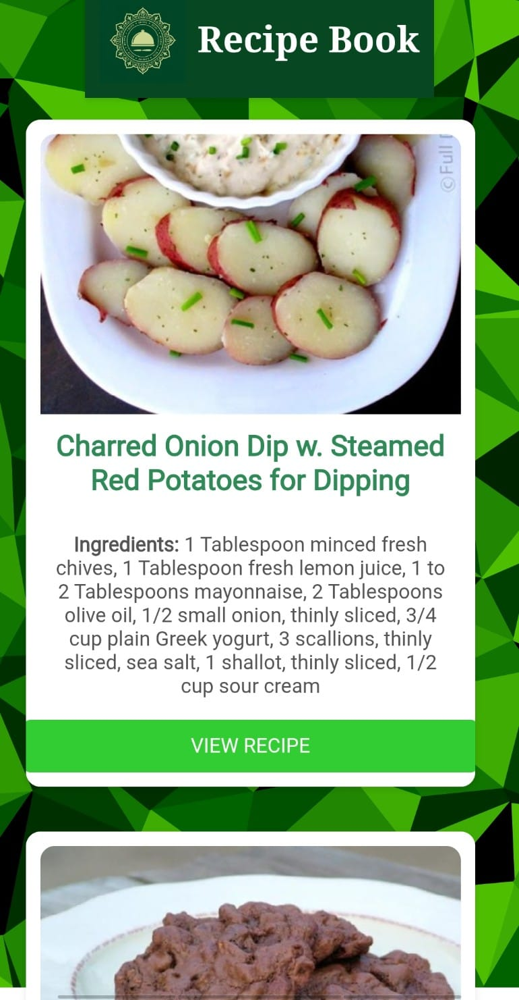

# 🍳 RecipeBook - Modern Recipe Discovery Platform

A beautiful, responsive web application for discovering and exploring delicious recipes from around the world. Built with vanilla HTML, CSS, and JavaScript, featuring a clean, modern design and seamless user experience.

## ✨ Features

- **🔐 User Authentication**: Secure login system with Google and Apple sign-in options
- **🍽️ Recipe Discovery**: Browse random recipes powered by Spoonacular API
- **📱 Responsive Design**: Optimized for both desktop and mobile devices
- **🎨 Modern UI**: Clean, intuitive interface with smooth animations
- **⚡ Fast Loading**: Lightweight and optimized for performance
- **🌐 Cross-Browser Compatible**: Works on all modern browsers

## 🚀 Live Demo

[](https://yourusername.github.io/RecipeBook)

## 📸 Screenshots

### Login Page

*Clean and modern login interface with Google/Apple sign-in options*

### Recipe Discovery Page

*Main recipe display page showing random recipes with images and ingredients*

### Mobile Responsive Design

*Fully responsive design optimized for mobile devices*

## 📁 Project Structure

```
RecipeBook/
├── 📁 css/                    # Stylesheets
│   ├── style.css             # Main styles
│   ├── styles.css            # Login page styles
│   ├── style-desktop.css     # Desktop-specific styles
│   └── style-mobile.css      # Mobile-responsive styles
├── 📁 js/                     # JavaScript files
│   ├── script.js             # Main application logic
│   ├── config.example.js     # API configuration template
│   └── config.js             # API configuration (ignored by git)
├── 📁 images/                 # Image assets
│   ├── logo.png              # Main logo
│   ├── log.png               # Login page logo
│   ├── log1.png              # Header logo
│   ├── back.jpg              # Background image
│   ├── img.png               # Additional background
│   ├── google.jpeg           # Google sign-in icon
│   ├── apple-icon-4.png      # Apple sign-in icon
│   └── low-poly-grid-haikei.svg # Decorative background
├── 📁 pages/                  # HTML pages
│   ├── loginpage.html        # User authentication page
│   └── intro.html            # Main recipe display page
├── 📁 screenshots/            # Project screenshots
│   ├── login-page.png        # Login page screenshot
│   ├── recipe-page.png       # Recipe page screenshot
│   └── mobile-view.png       # Mobile responsive screenshot
├── .gitignore                # Git ignore rules
└── README.md                 # Project documentation
```

## 🛠️ Technologies Used

- **Frontend**: HTML5, CSS3, JavaScript (ES6+)
- **API**: [Spoonacular API](https://spoonacular.com/food-api) for recipe data
- **Design**: Custom CSS with responsive design principles
- **Icons**: Custom icons and Google/Apple brand assets
- **Fonts**: Google Fonts (Montserrat)

## 🚀 Getting Started

### Prerequisites

- A modern web browser (Chrome, Firefox, Safari, Edge)
- Internet connection for API calls
- Spoonacular API key (optional for development)

### Installation

1. **Clone the repository**
   ```bash
   git clone https://github.com/yourusername/RecipeBook.git
   cd RecipeBook
   ```

2. **Open in your browser**
   - Simply open `pages/loginpage.html` in your web browser
   - Or use a local server for better development experience:
   ```bash
   # Using Python
   python -m http.server 8000
   
   # Using Node.js
   npx serve .
   
   # Using PHP
   php -S localhost:8000
   ```

3. **Access the application**
   - Navigate to `http://localhost:8000/pages/loginpage.html`
   - Or open the files directly in your browser

## 🎯 Usage

1. **Login Page**: Start at the login page where you can:
   - Sign in with Google or Apple
   - Use email/password authentication
   - Navigate to the main recipe page

2. **Recipe Discovery**: On the main page, you can:
   - View randomly generated recipes
   - See recipe images, titles, and ingredients
   - Click "View Recipe" to visit the full recipe on Spoonacular

## 🔧 Configuration

### API Configuration

The application uses the Spoonacular API for recipe data. To use your own API key:

1. Get a free API key from [Spoonacular](https://spoonacular.com/food-api)
2. Copy the configuration template:
   ```bash
   cp js/config.example.js js/config.js
   ```
3. Edit `js/config.js` and replace `your-api-key-here` with your actual API key:
   ```javascript
   const API_KEY = "your-actual-api-key-here";
   ```

**Note:** The `config.js` file is ignored by git for security reasons. Only the template file `config.example.js` is committed to the repository.

### Customization

- **Colors**: Modify CSS variables in the stylesheets to change the color scheme
- **Fonts**: Update font imports in CSS files
- **Images**: Replace images in the `images/` folder with your own assets
- **Layout**: Adjust responsive breakpoints in CSS media queries

## 📱 Responsive Design

The application is fully responsive and optimized for:
- **Desktop**: 1200px and above
- **Tablet**: 768px - 1199px
- **Mobile**: Below 768px

## 🎨 Design Features

- **Modern UI**: Clean, minimalist design with smooth animations
- **Green Theme**: Food-inspired color palette with various shades of green
- **Typography**: Professional font hierarchy using Montserrat
- **Interactive Elements**: Hover effects and smooth transitions
- **Accessibility**: Proper contrast ratios and semantic HTML

## 🔒 Security Features

- Form validation for user inputs
- Secure API key handling
- XSS protection through proper HTML escaping
- CSRF protection considerations

## 🚀 Future Enhancements

- [ ] User registration and profile management
- [ ] Recipe favorites and collections
- [ ] Search and filter functionality
- [ ] Recipe rating and reviews
- [ ] Social sharing features
- [ ] Offline support with service workers
- [ ] Progressive Web App (PWA) capabilities
- [ ] Dark mode toggle
- [ ] Recipe categories and tags
- [ ] Nutritional information display

## 🤝 Contributing

We welcome contributions! Please follow these steps:

1. Fork the repository
2. Create a feature branch (`git checkout -b feature/AmazingFeature`)
3. Commit your changes (`git commit -m 'Add some AmazingFeature'`)
4. Push to the branch (`git push origin feature/AmazingFeature`)
5. Open a Pull Request

## 📝 License

This project is licensed under the MIT License - see the [LICENSE](LICENSE) file for details.

## 👨‍💻 Author

**Your Name**
- GitHub: [@yourusername](https://github.com/yourusername)
- LinkedIn: [Your LinkedIn](https://linkedin.com/in/yourprofile)
- Email: your.email@example.com

## 🙏 Acknowledgments

- [Spoonacular API](https://spoonacular.com/food-api) for providing recipe data
- [Google Fonts](https://fonts.google.com/) for typography
- [Unsplash](https://unsplash.com/) for inspiration images
- The open-source community for various tools and resources

## 📊 Project Stats


---

⭐ **Star this repository if you found it helpful!**

🍳 **Happy Cooking!**
